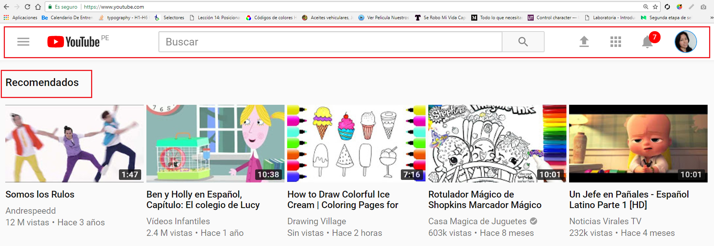
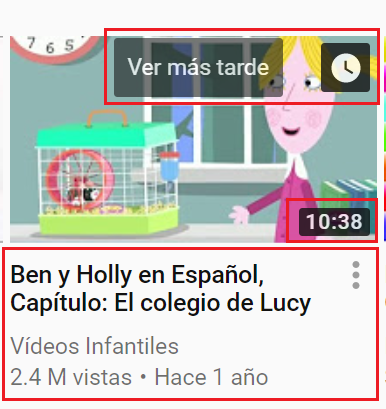
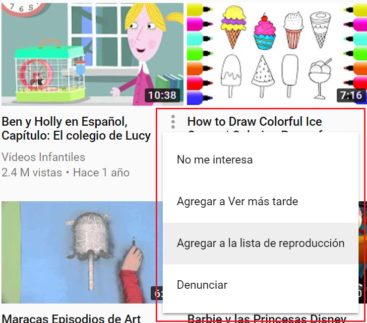
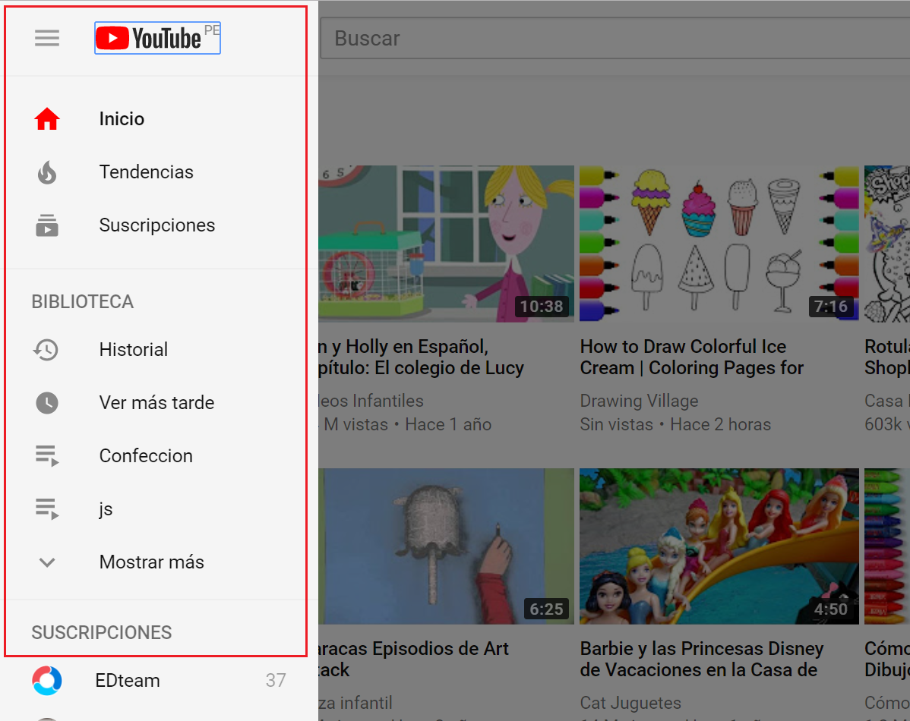
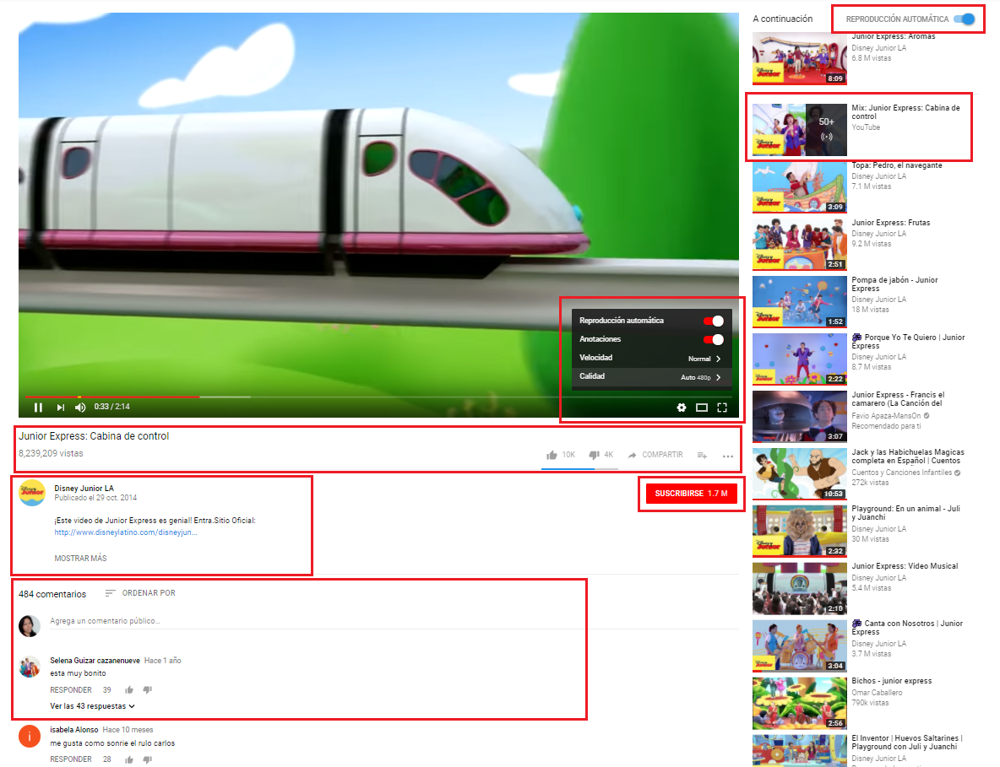

# Youtube

***

Acontinuación se describirá que parte conforma el rol del UX y de UI.

## UX 

* Que vaya un menú con las opciones especificas en la parte superior.
* Que los videos `recomendados` se visualicen al ingresar a la página.
* Que en las miniaturas de los videos tenga la opcion directa de `ver mas tarde`, 
  que el usuario pueda ver la duración del video, la categoria del video, número de vistas
  y hace cuanto se subió el video a la página.
* Que el usuario pueda pre-visualizar parte del video para ver de qué se trata antes de hacerle click.
* Las opciones que contienen los menús y el orden en que van puestos.
* Que el menú se despliegue y se oculte para que no ocupe un espacio permanente mientras se está navegamdo.

## UI

* Logo.
* Tipografía.
* Diseño de botones y menús.
* Colores en la página.
* Efectos con el mouse.
* Diseño de las barras de opciones en los videos y demás.
* Escoge el tipo de iconos que estan en la página.

## Imágenes

